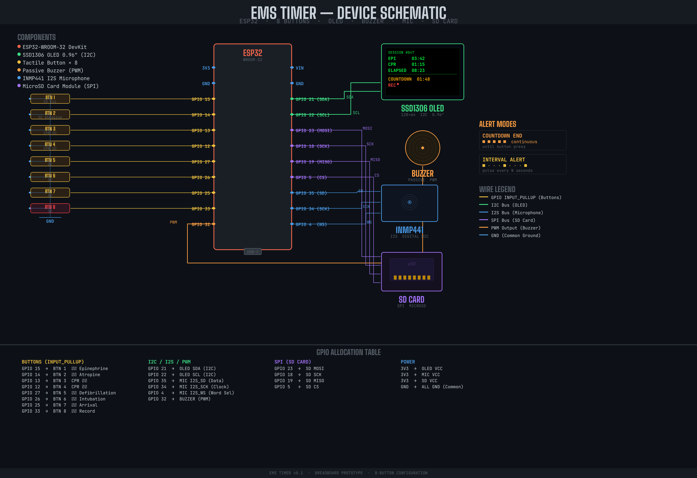
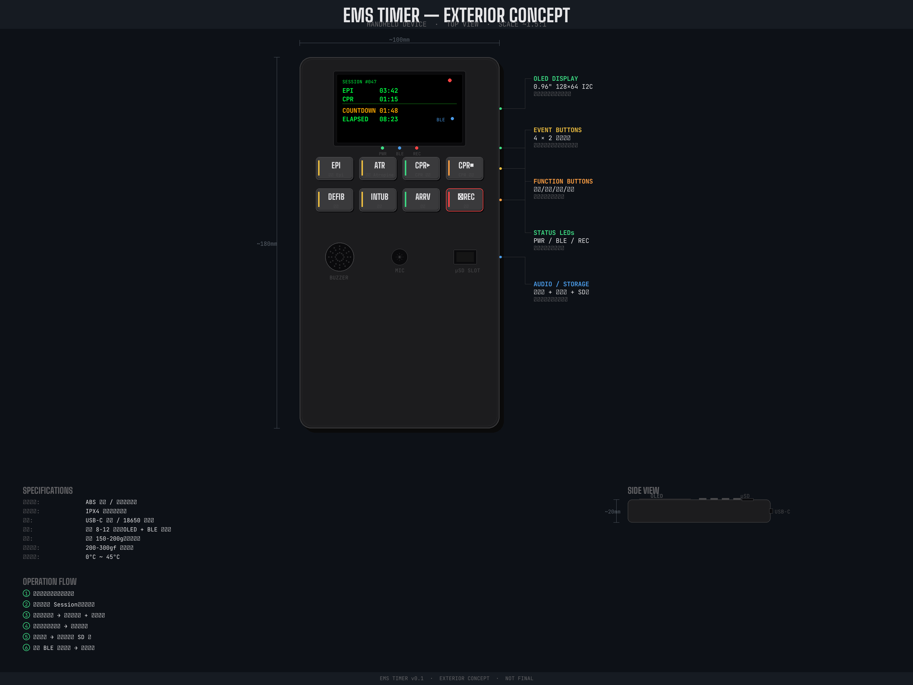

# EMS Timer — 救護計時器

給救護人員使用的手持計時裝置。按下按鈕記錄藥物給藥事件的時間戳與計時區間，事後透過藍牙傳輸至手機 App 檢視與保存。

## 功能特色

- **4 顆藥物計時按鈕**（BTN1~4）：支援兩組藥物群組切換，倒數計時 + 區間嗶聲提醒
- **4 顆系統功能按鈕**（BTN5~8）：選單導航、開關機（開發中）
- OLED 螢幕即時顯示當前事件與 mm:ss 計時
- 蜂鳴器提醒（倒數結束 3 聲 / 每分鐘區間嗶聲）
- BLE 藍牙（Nordic UART Service）：事後連線 App，`dump` 取完整事件紀錄
- 計時中斷記錄：切換藥物時自動封存前一筆計時結束時間點

## 硬體架構

| 元件 | 型號 / 規格 | 介面 |
|------|------------|------|
| 主控板 | ESP32-S3-DevKitC-1 | — |
| 螢幕 | SSD1306 OLED 0.96" | I2C（SDA/SCL = GPIO 42/41） |
| 按鈕 | 開關式按鈕 × 8（未來換單行程） | GPIO INPUT_PULLUP |
| 蜂鳴器 | 主動式蜂鳴器 | GPIO 14 |
| 麥克風 | INMP441 數位麥克風 | I2S（SCK/WS/SD = 40/39/38）|
| 儲存 | MicroSD 卡模組 | SPI（CS/MOSI/CLK/MISO = 10/11/12/13，待啟用）|

## 按鈕配置

| 按鈕 | GPIO | Group 0（預設） | 計時模式 | Group 1 | 計時模式 |
|------|------|----------------|---------|---------|---------|
| BTN1 | 4 | Epi（腎上腺素） | 倒數 5 分鐘 | Naloxone（納洛酮） | 正數 |
| BTN2 | 5 | Amio（胺碘酮） | 正數 | Nitro（硝化甘油） | 正數 |
| BTN3 | 6 | Atropine（阿托品） | 倒數 5 分鐘 | D50（50% 葡萄糖） | 正數 |
| BTN4 | 7 | Adenosine（腺苷） | 正數 | Morphine（嗎啡） | 正數 |
| BTN5 | 15 | Menu（開啟選單 / 確認群組切換） | — | — |
| BTN6 | 16 | Next（選單游標向下） | — | — |
| BTN7 | 17 | Prev（選單游標向上） | — | — |
| BTN8 | 18 | Power（待實作） | — | — |

## BLE 通訊協定

服務：Nordic UART Service（NUS）

| 命令（App → 裝置） | 說明 |
|-------------------|------|
| `{"cmd":"sync","ts":<epoch_ms>}` | 時間同步 |
| `{"cmd":"dump"}` | 批次取得所有事件紀錄 |
| `{"cmd":"clear"}` | 清空事件陣列 |

事件欄位：`event_type` / `label` / `ts`（epoch ms）/ `el`（session 起算 ms）/ `end`（結束/中斷 ms，0=計時中）

## 開發階段

- [x] **Phase 1**（2026-04-17）— 硬體原型：ESP32-S3 + 8 按鈕 + OLED + 蜂鳴器驗收通過
- [x] **Phase 2**（2026-04-21）— 計時邏輯 + BLE NUS 可行性測試通過
  - Phase 2A：EmsEvent 資料結構、倒數 state machine、OLED 計時顯示
  - Phase 2B：BLE NUS sync/dump/clear 命令實測通過
  - Phase 2C：藥物分組架構、系統按鈕分離、計時中斷記錄
- [ ] **Phase 2.x** — BTN5~8 選單與系統功能實作（部分完成）
  - [x] BTN5 Menu：開啟/確認藥物群組切換；同時中斷進行中計時
  - [x] BTN6/7 Next/Prev：選單游標導航（5s 無操作自動關閉）
  - [ ] BTN8 Power：待換單行程按鍵後加長按偵測再啟用 deep sleep
- [ ] **Phase 1.5** — INMP441 麥克風重試（換新模組後啟用）
- [ ] **Phase 3** — 手機 App + DS3231 RTC 升級
- [ ] **Phase 4** — 整合測試、電源方案、外殼設計、量產化

## 量產化路線

| 階段 | 硬體方案 | 說明 |
|------|---------|------|
| 現在 | 麵包板 + 杜邦線 | 韌體驗證 |
| 原型機 | 洞洞板手焊 | 使用者試用與功能測試 |
| 小批量 | 客製 PCB 手焊 | 5~10 台，確認設計定版 |
| 正式版 | PCB + SMT 代焊 | 機器焊接被動元件，降低組裝成本 |

PCB 設計工具：KiCad；製造：JLCPCB。外殼以 3D 列印製作，換單行程 tactile 按鍵後同步啟用 BTN8 長按電源管理。

## 文件索引

| 文件 | 說明 |
|------|------|
| [CLAUDE.md](CLAUDE.md) | 專案需求規格、資料模型、開發決策 |
| [tasks/todo.md](tasks/todo.md) | 詳細開發進度與待辦清單 |
| [tasks/phase2-acceptance.md](tasks/phase2-acceptance.md) | Phase 2 驗收清單 |
| [design-philosophy.md](design-philosophy.md) | 視覺設計哲學（Technical Cartography） |

## 概念設計預覽

### 電路配置

### 外觀概念

